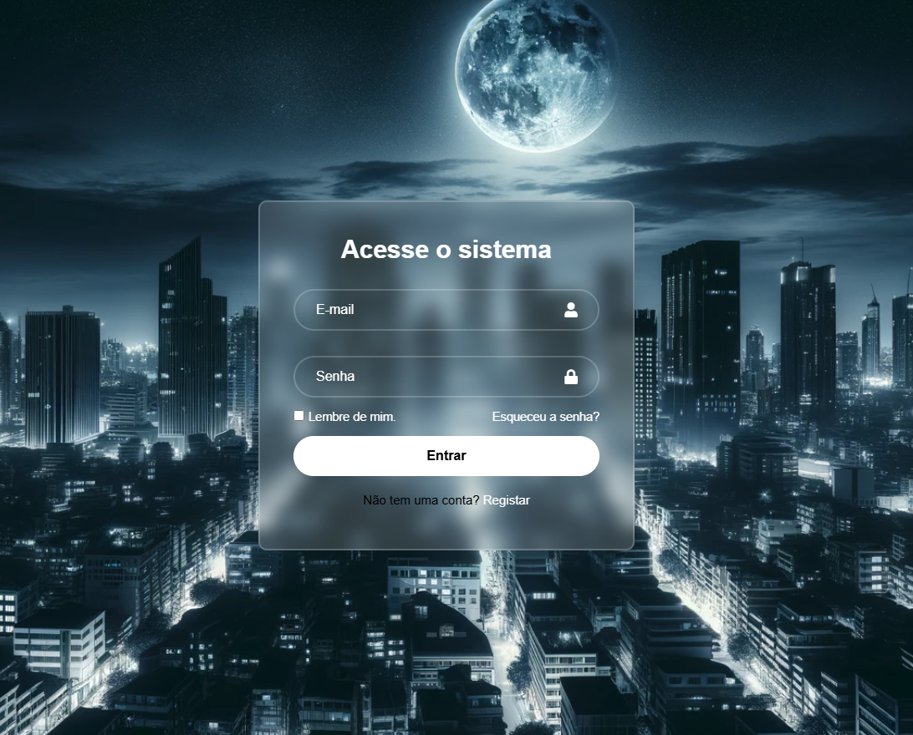

# Tela de Login 🔐

Este é um projeto simples de tela de login desenvolvido com **React** e **CSS**, utilizando o **Vite** como ferramenta de build. O objetivo principal é aprimorar os conceitos fundamentais do React, como componentes, estados e propriedades, em um ambiente rápido e moderno.

---

## 🎯 Objetivo do Projeto

- **Aprimorar os conceitos em React**.
- Explorar o uso do **Vite** para desenvolvimento e build de projetos React.
- Criar uma interface funcional e estilizada para login.
- Implementar boas práticas na construção de componentes reutilizáveis.

---

## 🛠️ Tecnologias Utilizadas

- **React**: Biblioteca JavaScript para construção da interface.
- **Vite**: Ferramenta de build rápida para desenvolvimento de aplicações modernas.
- **CSS**: Para estilização do layout e responsividade.

---

## 📚 Funcionalidades

- Interface de login com campos para **e-mail** e **senha**.
- Botão de envio com validação visual básica.
- Layout responsivo, adaptado para diferentes dispositivos.

---

## 🖼️ Prévia

Acesse a página online: [Live Demo](https://leandroazevedo-1.github.io/pagina-login-react/).

